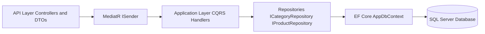
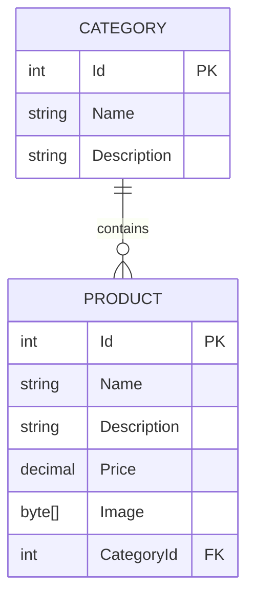
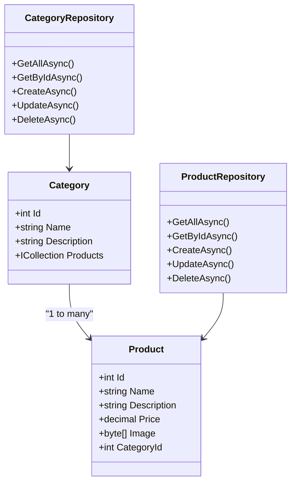
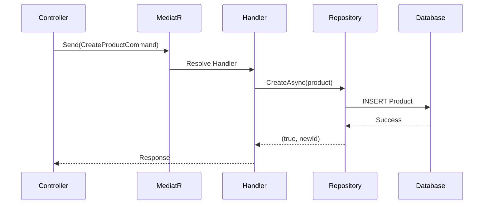

# 📦 InventoryApp — ASP.NET Core 10 Web API  
### Clean Architecture • EF Core • Repository Pattern • CQRS • MediatR


A modern **ASP.NET Core 10 Web API** for managing **Inventory (Products + Categories)** built using scalable, enterprise-grade backend architecture.

This project demonstrates:

- ✔ CQRS with MediatR  
- ✔ Repository Pattern  
- ✔ EF Core Code-First  
- ✔ Seeded Categories & Products  
- ✔ Multipart Image Upload (byte[])  
- ✔ Clean 3-Layer Architecture  
- ✔ Minimal controllers — logic in handlers  

---

# 🏛 Architecture Overview

## 📁 Solution Structure

```
InventoryApp/
│
├── MyApp.API/            → Presentation Layer (Controllers, DTOs)
├── MyApp.Application/    → CQRS (Commands & Queries), MediatR Handlers
└── MyApp.Data/           → EF Core, Repositories, Entities, Migrations
```

---

# 🔷 Architecture Diagram


---

# 🗄 Database ERD (Entity Relationship Diagram)



---

# 🔶 UML Class Diagram



---

# 🧱 Domain Model

### **Category**
- Id  
- Name  
- Description  
- Products (Navigation)

### **Product**
- Id  
- Name  
- Description  
- Price  
- Image (byte[])  
- CategoryId (FK)

Relationship:

```
Category 1 --- * Product
```

---

# 🚀 API Endpoints

## 📁 Categories

### **GET /api/categories**
```json
[
  {
    "id": 1,
    "name": "Electronics",
    "description": "Devices, gadgets, and smart technology products."
  }
]
```

### **GET /api/categories/{id}**
```json
{
  "id": 1,
  "name": "Electronics",
  "description": "Devices, gadgets, and smart technology products."
}
```

### **POST /api/categories**
```json
{
  "name": "Furniture",
  "description": "Home & office furniture"
}
```

### **PUT /api/categories/{id}**
```json
{
  "name": "Updated Electronics"
}
```

### **DELETE /api/categories/{id}**
```
Category with id 3 Deleted
```

---

## 📦 Products

### **GET /api/products**
```json
[
  {
    "id": 1,
    "name": "Smartphone X",
    "price": 899.99,
    "categoryId": 1
  }
]
```

### **GET /api/products/{id}**
```json
{
  "id": 1,
  "name": "Smartphone X",
  "price": 899.99,
  "categoryId": 1
}
```

### **POST /api/products** *(multipart/form-data)*

Fields:
```
Name: Laptop
Description: Gaming laptop
Price: 1500
Image: <file>
CategoryId: 1
```

Response:
```
Product with id 11 is Created
```

### **PUT /api/products/{id}**
Supports multipart form-data for image replacement.

### **DELETE /api/products/{id}**
```
Product with id 4 Deleted
```

---

# 📸 Image Upload Handling

```csharp
using var stream = new MemoryStream();
await Image.CopyToAsync(stream);
return stream.ToArray();
```

---

# 🧠 CQRS Sequence Diagram



---

# 🗃 Database Seeding

### Categories  
- Electronics  
- Clothing  
- Sports  
- Home & Kitchen  
- Books  
- Beauty  
- Toys  
- Automotive  
- Groceries  
- Accessories  

### Products  
- Smartphone X  
- Wireless Headphones  
- Men's T-Shirt  
- Yoga Mat  
- Kids Puzzle Set  
- Organic Olive Oil  
…and more.

---

# ▶️ How to Run Locally

### 1️⃣ Configure SQL connection  
In `appsettings.json`:

```json
"ConnectionStrings": {
  "constr": "Server=.\\SQLEXPRESS;Database=InventoryAppDb;Integrated Security=SSPI;TrustServerCertificate=True;"
}
```

### 2️⃣ Apply migrations
```bash
dotnet ef database update --project MyApp.Data --startup-project MyApp.API
```

### 3️⃣ Run the API
```bash
dotnet run --project MyApp.API
```

### 4️⃣ Open Swagger
```
https://localhost:<port>/swagger
```

---

# 👤 Author

**Mady**  
ASP.NET Core Backend Developer  
Clean Architecture • CQRS • EF Core  

---

# ⭐ If you like this project, consider giving it a star!
